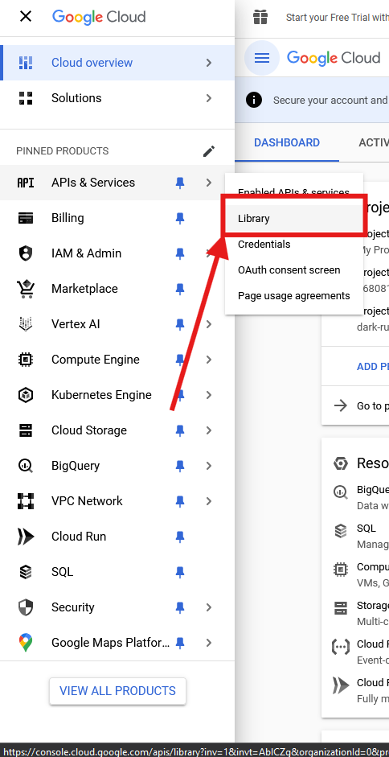

# Как создать проект в Cloud Google Console?

1. Переходим на сайт https://console.cloud.google.com
	1. При первом запуске будет следующее окно 
      
	2. Выбираем любую страну (пока Россия не доступна) и соглашаемся с условиями использования
	3. Нажимаем кнопку "AGREE AND CONTINUE"
2. Нажимаем кнопку "Select a project" (если уже есть проекты, то надпись будет - название последнего открытого проекта, но при нажатии на кнопку всё равно появится 3-й пункт) 
   
   
3. Дальше видим окно с проектами, если в первый раз, то не будет проектов, но нас интересует кнопка "New Project" - нажимаем 
   
4. Называем проект и при желании можно запарится - создать/выбрать организацию, но это не обязательно 
   
5. Ждём, когда создатся проект 
   
6. Проект создался, выбираем проект 
   
7. Нас после выбора перекидывает на страницу Dashboard 
   
8. Нужно навести курсор на "APIs & Services" и нажать на "Library" 
   
9. Открывается страница библиотеки API 
   
10. В поиске вбиваем интересующие нас API (дальше будет пример с Sheet): 
    
    1. Для работы с диском - Drive (создание файлов и папок, получение списка файлов и папок, удаление файлов и папок)
    2. Для работы с таблицами - Sheet (редактирование таблиц)
    3. Для работы с календарём - Calendar
    4. Для работы с почтой - Gmail
    5. Для работы с Youtube - YouTube Data API (если нужна аналитика - YouTube Analytics API)
    6. Есть и другие, но они вряд-ли пригодятся
11. Получив результат выбираем нужное API (если нашлось несколько выбираем нужный) 
    
12. Активируем API 
    
13. Нас перекидывает на страницу с отчётом по работе API (количество запросов, статус, ошибки) 
    
14. Слева в меню выбираем Credentials 
    
15. Есть 3 способа авторизации приложения:
    1. API Keys - ???
    2. OAuth 2.0 - для использования приложения необходимо авторизоваться
    3. Service Account - для использования приложения необходимо пригласить и дать доступ аккаунту нашего приложения
16. В основном нам будет хватать Service Account, поэтому кликаем на CREATE CREDENTIALS 
    
17. Выбираем Service account
     
18. Называем как-нибудь наш аккаунт, email генерируется автоматически, если необходимо - пишем описание, и затем нажимаем кнопку CREATE AND CONTINUE 
    
19. Дальше выбираем роль, зачастую будет хватать базовых (Basic) ролей, а точнее одной роли - Editor (редактор). Роль редактор позволяет читать и изменять документы. 
    
20. Нажимаем кнопку CONTINUE 
    
21. Теперь нужно выдать доступы для управления этим аккаунтом, вписываем свою почту в оба поля, и при необходимости какие-нибудь другие 
    
22. Жмём кнопку DONE 
    
23. Казалось бы всё, но увы нет :(
24. Нас перекидывает на страницу Credentials, где мы должны нажать на почту нами созданного аккаунта (именно на почту) или на значок редактирования (ручка) 
    
25. Открывается страница описания нашего аккаунта, нам нужно нажать в меню на KEYS 
    
26. Нажимаем на кнопку ADD KEY 
    
27. Открывается выпадающее меню, нам нужно выбрать "Create new key" 
    
28. По умолчанию в типе ключа выбран JSON, но если не выбран, выберете JSON, дальше нажимаем кнопку CREATE 
    
29. Закрываем информационное окно 
    
30. У нас автоматически в браузере скачался файл ключа 
    
31. Ну и в целом на этом всё, закидываем файл в наш проект, переименовываем как будет удобно, приглашаем по почте в документ как редактора наш аккаунт, используем документацию для авторизации по этому ключу в коде
